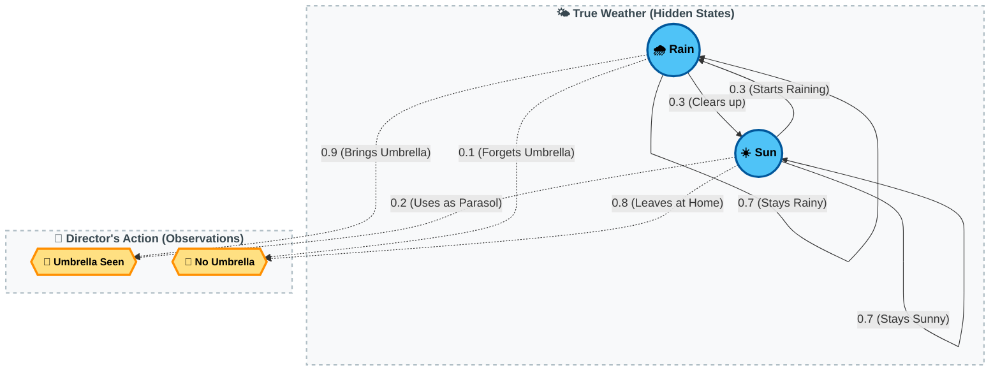
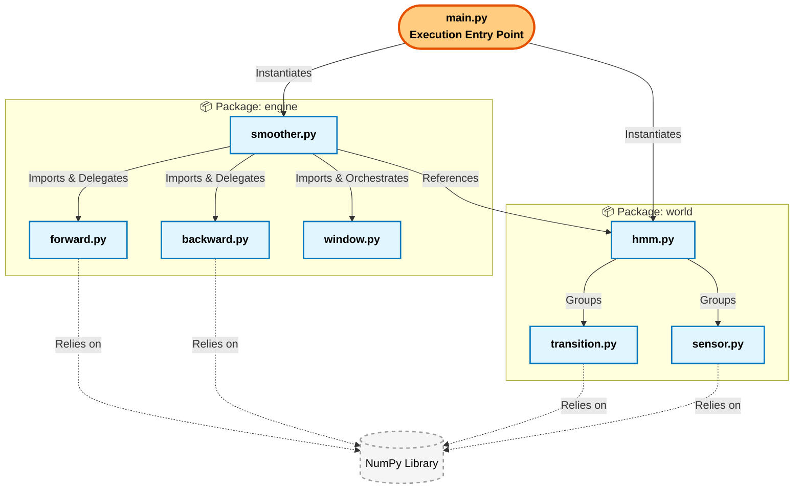
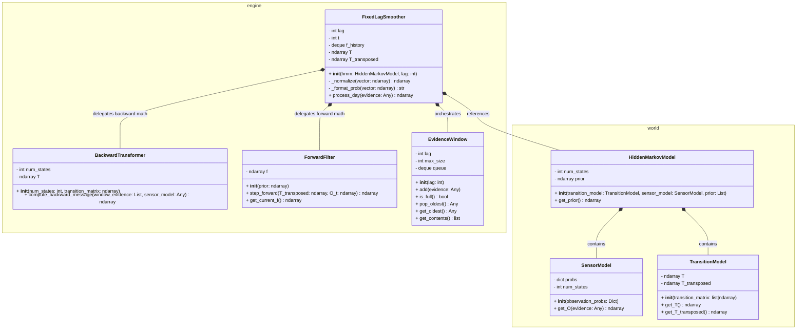
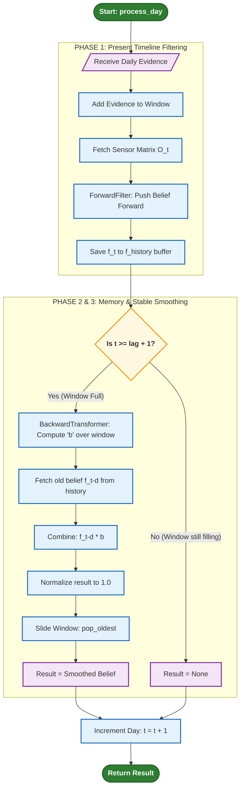
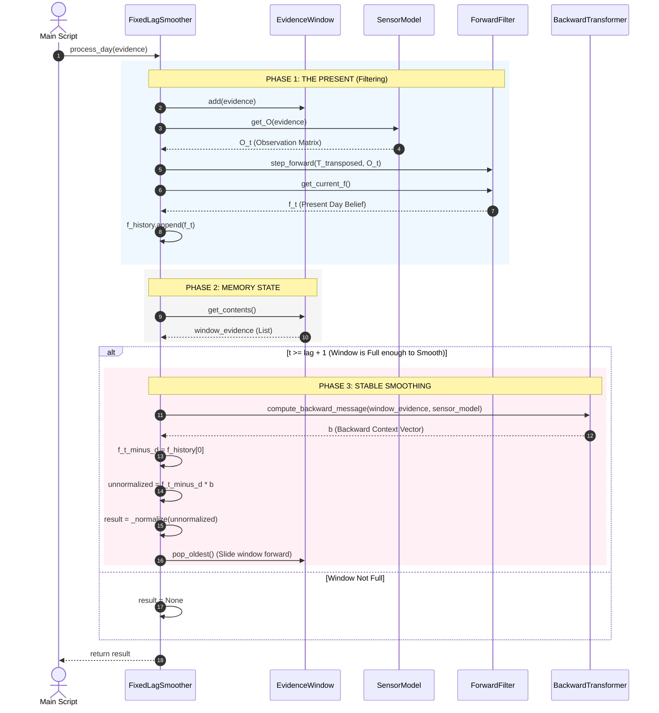

# Umbrella World Fixed-Lag Smoothing Engine for Hidden Markov Models


A modular, mathematically stable, object-oriented Python engine for performing Fixed-Lag Smoothing in a Hidden Markov Model (HMM) environment. 

This project implements a robust algorithmic solution to the classic Umbrella World problem (from Russell & Norvig's Artificial Intelligence: A Modern Approach). It demonstrates how to update past beliefs based on future evidence while strictly preventing floating-point underflow (catastrophic cancellation) during extended time-series processing. 

As a bonus, it includes a fully-featured, interactive Graphical User Interface (GUI) built on an MVC architecture to visualize the smoothing process in real-time.

---

## 1. Project Overview

In real-world tracking, sensors are flawed, and the underlying state of the world is hidden. 

* Filtering estimates the present state based on evidence up to the present. 
* Smoothing goes a step further: it delays the final estimation by a lag of L days, using the evidence from those L future days to mathematically correct and refine our belief about the past.

This codebase is designed with a strict separation of concerns. It decouples the World (domain rules like weather and sensors) from the Engine (the mathematical operations handling forward filtering and backward smoothing), making it highly extensible to other domains like robot localization or stock market prediction.

---

## 2. Academic & Mathematical Foundation


### The Umbrella World Concept

We model a world with two hidden states: Rain and Sun. We cannot observe the weather directly; we only observe whether the director brings an umbrella or not. 



---

## 3. System Architecture (Technical Details)

The system relies on strict Object-Oriented principles, keeping the domain models cleanly separated from the mathematical engines.

### Package Dependencies (Component Architecture)

The execution scripts act as assembly lines. The world package knows nothing about the algorithms operating on it.



### Object-Oriented System Design

The FixedLagSmoother acts as an orchestrator. Instead of being a monolithic mathematical script, it delegates forward math to ForwardFilter, backward math to BackwardTransformer, and memory management to the EvidenceWindow.



### The Daily Processing Cycle

Every single day, without fail, the system updates its present-day belief. If the evidence window is full, it executes the backward pass to rectify the past.





---

## 4. Handling Numerical Stability (Practical Details)

A common pitfall in standard HMM textbook implementations is catastrophic cancellation (floating-point underflow). When multiplying probabilities over long time horizons, the numbers quickly collapse to 0.0, resulting in division-by-zero errors.

In our engine (specifically the backward and forward steps), we strictly prevent underflow by normalizing the vectors at every individual time step. By dividing the raw probabilities by their sum at each step, we ensure the algorithm can run infinitely (e.g., a 10,000-day stress test) without mathematical failure, ensuring real-world practical application.

```python
# The stable backward formula
b_raw = self.T @ O_k @ b

# Normalize 'b' at each step to strictly prevent floating-point explosion or collapse
total = np.sum(b_raw)
if total > 0:
    b = b_raw / total
```

---

## 5. Installation & Usage

### Prerequisites

* Python 3.8+
* numpy (for mathematical matrix operations)
* matplotlib (for GUI plotting)

### Installation

Clone the repository and install the requirements using standard pip install commands:
python -m pip install numpy matplotlib

### Running the CLI Simulation (Stress Test)

To run the automated 35-day stress test script natively in the terminal, execute:

    python main.py

This runs a rigorous predefined sequence proving the engine's mathematical stability over extended timeframes, printing the step-by-step logic directly to the console.

---

## 6. Bonus: The Interactive GUI Module

While the engine is robust and strictly numerical, this repository includes a fully-featured Graphical User Interface (GUI) module, unlike the rest of modules, **built with LLMs help for better experience.** If you want to experience Fixed-Lag Smoothing in a user-friendly UI instead of reading terminal logs, running the GUI application is the way to go.

### How to Run the GUI

To launch the interactive GUI, simply run:

    python app.py

### High-Level Structure and How it Works

The GUI is built using Tkinter and Matplotlib, structured strictly around the Model-View-Controller (MVC) architectural pattern to ensure it does not interfere with the core mathematical engine.

* The Model: The core mathematical Engine and World packages you interact with via the CLI.
* The View: Composed of main_window.py (layout and user inputs), plotter.py (real-time Matplotlib charts), and math_view.py (mathematical formula rendering).
* The Controller: The simulation_controller.py acts as the brain of the GUI. 

When you start the simulation, the Controller initializes the FixedLagSmoother. As you feed evidence (Umbrella / No Umbrella) via the UI, the Controller passes this to the Engine. It then intercepts the calculated forward probabilities and smoothed backward probabilities, formats them, and broadcasts them to the Plotter and Log panels simultaneously. This allows you to visually watch the Forward Filter react in real-time, while the Smoothed Line trails L days behind, rectifying the past dynamically.

```

```
